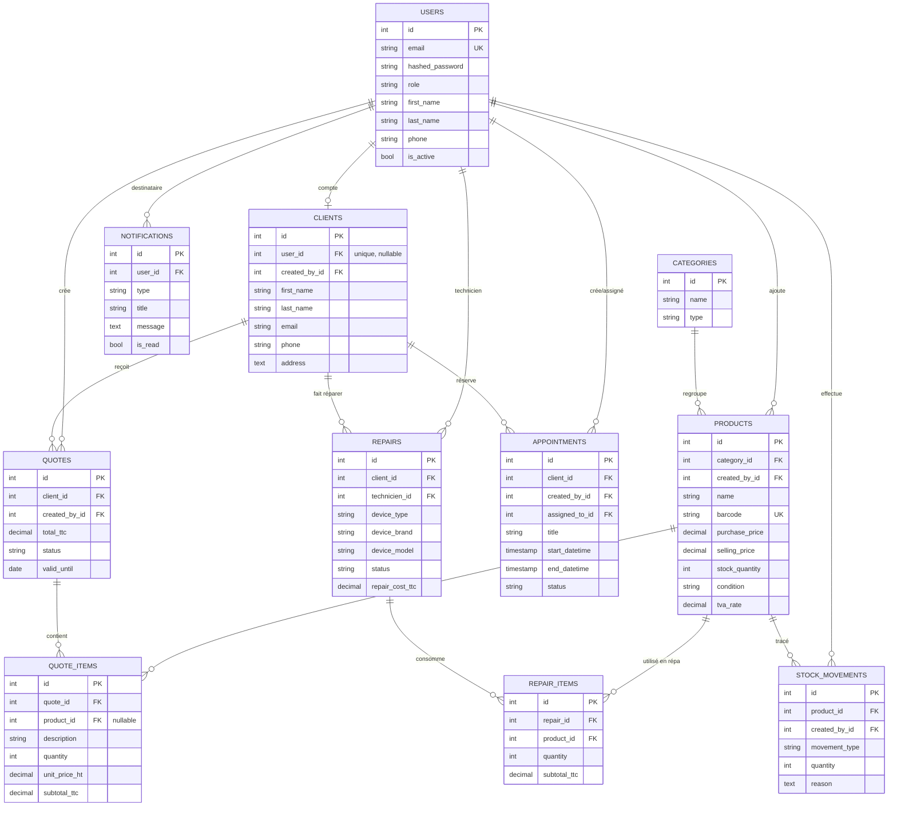

# Schéma de la base de données

11 tables PostgreSQL, gérées par SQLAlchemy 2.0 et versionnées avec Alembic. Les modèles
font foi : [`backend/app/models/`](../backend/app/models/).

## Organisation

| Domaine | Tables |
|---|---|
| Identité et accès | `users`, `clients` |
| Catalogue et stock | `categories`, `products`, `stock_movements` |
| Devis | `quotes`, `quote_items` |
| Réparations | `repairs`, `repair_items` |
| Planning et alertes | `appointments`, `notifications` |

## Diagramme entité-association



## Choix de modélisation

**Séparation `users` / `clients`.** Un client de la boutique n'a pas forcément de compte :
`clients.user_id` est nullable et unique. Une fiche peut donc être créée au comptoir, puis
rattachée plus tard à un compte si la personne souhaite accéder au portail. Le personnel
(admin, vendeur, technicien) n'existe que dans `users`.

**Lignes de document dissociées du catalogue.** `quote_items` et `repair_items` figent
le prix et le taux de TVA au moment de l'opération. Modifier le prix
d'un produit ne réécrit donc jamais l'historique — indispensable pour des pièces comptables.
`quote_items.product_id` est nullable : un devis peut porter une prestation libre, décrite
en texte, sans référence au catalogue.

**Prix et TVA en `decimal`.** Jamais de flottant sur des montants : les erreurs d'arrondi
binaires sont inacceptables sur des écritures comptables.

**`condition` sur les produits.** Distingue le neuf de l'occasion, ce qui détermine le
régime de TVA appliqué aux pièces facturées — TVA classique ou TVA sur marge. Voir les règles métier dans le
[README](../README.md).

**Stock tracé plutôt que calculé.** `products.stock_quantity` porte l'état courant tandis
que `stock_movements` conserve chaque entrée et sortie avec son motif. La redondance est
assumée : elle évite de recalculer un cumul à chaque affichage tout en préservant l'audit.

## Générer une image du diagramme

Le bloc Mermaid ci-dessus est rendu automatiquement par GitHub. Pour l'exporter en PNG ou
SVG, le coller sur [mermaid.live](https://mermaid.live).

## Faire évoluer le schéma

Toute modification passe par une migration Alembic, jamais par une écriture directe :

```bash
docker compose exec backend alembic revision --autogenerate -m "description"
docker compose exec backend alembic upgrade head
```
